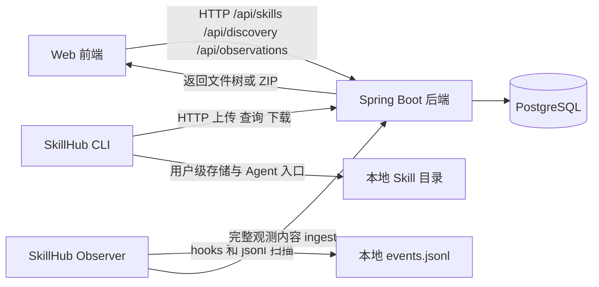

# SkillHub

SkillHub 是一个轻量的 Skill Hub，用于上传、浏览、下载、安装和观测 AI Agent Skill。

项目核心能力：

- Web 端上传 ZIP、目录或单个 `SKILL.md`
- Web 端和 CLI 查询平台技能
- Web 端和 CLI 下载、安装指定技能
- Observer CLI 采集本地技能调用，生成本地 HTML 报告，并把平台已有技能的完整观测内容上传到平台

## 一、启动项目

### 1. 环境要求

- Java 8 或更高版本
- Maven 3.6 或更高版本
- Node.js 20 或更高版本（SkillHub CLI 和 Observer CLI 要求）
- npm
- Docker Desktop 和 PostgreSQL 16（推荐使用 Docker）

### 2. 启动 PostgreSQL

后端默认连接：

```text
jdbc:postgresql://localhost:5432/skillhub
用户名：postgres
```

如果本机已经有名为 `pg-16` 的 PostgreSQL 容器：

```bash
docker start pg-16
```

首次启动可以创建一个新的开发数据库容器（已有同名容器时不需要重复执行）：

```bash
docker volume create skillhub-pg-data
docker run --name skillhub-postgres \
  -e POSTGRES_DB=skillhub \
  -e POSTGRES_USER=postgres \
  -e POSTGRES_PASSWORD=123456 \
  -p 5432:5432 \
  -v skillhub-pg-data:/var/lib/postgresql/data \
  -d postgres:16-alpine
```

检查容器状态：

```bash
docker ps
```

### 3. 启动后端

在项目根目录执行：

```bash
cd backend
mvn spring-boot:run
```

后端启动后地址为：

```text
http://localhost:8080
```

Flyway 会在首次启动时自动执行数据库迁移，创建技能、发现技能和观测相关表。

也可以先打包再启动：

```bash
cd backend
mvn clean package
java -jar target/skill-hub-0.1.0-SNAPSHOT.jar
```

### 4. 启动前端

打开另一个终端：

```bash
cd frontend
npm install
npm run dev
```

访问：

```text
http://localhost:5173
```

Vite 会把前端的 `/api` 请求代理到 `http://localhost:8080`。因此使用前端页面前，必须先启动后端。

前端生产构建：

```bash
cd frontend
npm run build
```

### 5. 快速验证

后端和前端都启动后，可以检查 CLI 是否能连接服务：

```bash
skillhub list --service-url http://127.0.0.1:8080
```

如果还没有全局安装 CLI，也可以使用源码构建后的入口：

```bash
cd cli
npm install
npm run build
node dist/index.js list --service-url http://127.0.0.1:8080
```

## 二、CLI 安装与命令

### 1. 安装 CLI

#### 从 npm 全局安装（推荐）

```bash
npm install -g @second196/skillhub-cli
```

安装后可以使用 `skillhub` 或 `skillhub-cli`，两者指向同一个 CLI：

```bash
skillhub --version
skillhub --help
```

#### 从源码构建

```bash
cd cli
npm install
npm run build
```

直接运行构建产物：

```bash
node dist/index.js --help
```

也可以在 `cli` 目录中全局安装当前源码版本：

```bash
npm install -g .
```

CLI 支持 macOS 和 Windows。要求 Node.js 20 或更高版本，安装目录使用相对路径时会根据当前操作系统解析。

完整的 Agent 安装说明见 [`docs/skillhub-cli-installation-guide.md`](docs/skillhub-cli-installation-guide.md)。

### 2. 全局选项

所有命令默认连接：

```text
http://127.0.0.1:8080
```

后端不在本机时，使用：

```bash
--service-url http://your-host:8080
```

添加 `--json` 可以输出机器可读的 JSON，方便脚本或 Agent 解析。

### 3. 上传技能

命令格式：

```bash
skillhub upload <input-path...> [options]
```

`<input-path...>` 可以一次传入一个或多个：

- ZIP 文件
- Skill 目录
- 单个 `SKILL.md` 文件

批量上传示例：

```bash
skillhub upload ./skill-a ./skill-b ./skill-c --category 研发
skillhub upload ./skill-a.zip ./skill-b.zip --category 工具 --json
```

每个输入会独立处理，一个失败不会阻止其他输入；命令结束时会汇总成功和失败结果。批量命令只要存在失败项，就会返回非 0 退出码。

选项：

| 选项 | 默认值 | 说明 |
| --- | --- | --- |
| `--category <category>` | `其他` | 技能分类 |
| `--name <name>` | 自动生成 | 没有根目录 `SKILL.md` 的复合包名称覆盖值 |
| `--description <description>` | 自动生成 | 没有根目录 `SKILL.md` 的复合包描述覆盖值 |
| `--service-url <url>` | `http://127.0.0.1:8080` | SkillHub 后端地址 |
| `--json` | 关闭 | 输出 JSON |

示例：

```bash
skillhub upload ./my-skill.zip --category 研发
skillhub upload ./my-skill --category 研发
skillhub upload ./my-skill/SKILL.md --category 工具
skillhub upload ./my-skill.zip --category 研发 --service-url http://192.168.1.10:8080
skillhub upload ./my-skill.zip --category 研发 --json
```

上传包要求：

- 有根目录 `SKILL.md` 时，整个目录或 ZIP 会作为一个完整 Skill 上传，嵌套的子 Skill 和其他资源会原样保留。
- 没有根目录 `SKILL.md` 但包含多个嵌套 `SKILL.md` 时，CLI 和后端会识别为复合 Skill，自动生成根入口文件，不会选择或拆分某一个子 Skill。
- 复合 Skill 的名称和描述会依次从包内标准配置、README 标题和正文、输入目录或 ZIP 名称中生成；可以使用 `--name` 和 `--description` 覆盖。
- `SKILL.md` 必须使用 UTF-8 编码并包含 YAML frontmatter。
- frontmatter 必须包含 `name` 和 `description`。
- `version` 可选；省略时使用 `0.0.0`。
- 如果填写 `version`，必须是语义化版本号，例如 `1.0.0` 或 `1.2.3-beta.1`。
- 不要上传符号链接、`.env`、凭据、私钥或不安全路径。
- CLI 与后端对单个压缩包、解压后总大小和单个文件的容量上限均为 1GiB。

### 4. 查询技能

命令格式：

```bash
skillhub list [options]
```

选项：

| 选项 | 默认值 | 说明 |
| --- | --- | --- |
| `--category <category>` | 不筛选 | 只查询指定分类 |
| `--service-url <url>` | `http://127.0.0.1:8080` | SkillHub 后端地址 |
| `--json` | 关闭 | 输出完整 JSON 列表 |

示例：

```bash
skillhub list
skillhub list --category 研发
skillhub list --service-url http://192.168.1.10:8080
skillhub list --json
```

普通输出包含技能名称、Slug、分类、版本和状态。下载量可在 Web 技能搜索页和详情页查看。

### 5. 安装平台技能

命令格式：

```bash
skillhub install <slug> [options]
```

选项：

| 选项 | 默认值 | 说明 |
| --- | --- | --- |
| `--target <directory>` | 用户级目录 | 显式指定项目或自定义安装目录 |
| `--version <digest>` | 最新版本 | 指定版本摘要 |
| `--service-url <url>` | `http://127.0.0.1:8080` | SkillHub 后端地址 |
| `--json` | 关闭 | 输出 JSON |

不传 `--target` 时，CLI 会把技能保存到 SkillHub 的用户级存储，并为检测到的 Agent 创建用户级入口。传入 `--target` 时，最终目录为 `<target>/<slug>`，用于明确的项目级或自定义安装。

示例：

```bash
skillhub install using-product-development
skillhub install ui-ux-pro-max --target .skills
skillhub install token-efficient-development --target ./vendor/skills
skillhub install using-product-development --version <version-digest>
skillhub install using-product-development --service-url http://192.168.1.10:8080 --json
```

`install` 会下载平台生成的 ZIP 并解压。无 `--target` 时，CLI 会根据操作系统使用用户级存储，并检测常见 Agent 的用户级技能目录，优先创建目录链接，不能链接时回退为复制。这样切换项目后仍然可以使用同一份技能。安装成功会计入该技能的累计下载量。CLI 只提供上传、查询和安装命令，不提供删除技能命令。

### 6. Agent 操作 Skill

仓库中的 `skill/` 目录提供了让 Agent 识别 SkillHub CLI 的操作说明。按照安装指南，可以使用：

```bash
npx skills add https://github.com/second196/skill-hub-simple/tree/main/skill
```

安装后，Agent 可以根据该说明调用：

```bash
skillhub upload <path> [<path> ...] --category <category>
skillhub list
skillhub install <slug>
```

## 三、Observer CLI

观测能力和技能上传/安装是两套命令。`@second196/skillhub-cli` 只负责技能包；`@second196/skillhub-observer` 负责采集、本地报告和上传观测数据。

### 1. 安装

```bash
npm install -g @second196/skillhub-observer
skillhub-observer --help
```

也可以从源码构建：

```bash
cd observer
npm install
npm run build
node dist/index.js --help
```

### 2. 命令

```bash
skillhub-observer install
skillhub-observer report --open
skillhub-observer report -o ./observation-report.html --service-url http://127.0.0.1:8080
skillhub-observer upload --service-url http://127.0.0.1:8080
```

- `install`：写入 Claude Code / Codex hooks。对话结束时扫描 `~/.claude/projects/**/*.jsonl` 和 `~/.codex/sessions/**/*.jsonl`，合并进本机 `events.jsonl`。Hook 失败不会阻塞 Agent。
- `report`：生成本地完整 HTML 报告，包含平台没有的技能。提供 `--service-url` 时会标记「可上传」或「仅本地」。
- `upload`：只上传平台已有技能（含已下架）出现过的回合；上传完整用户原文、完整工具参数/结果、完整文档正文，不生成摘要。

默认本地目录：

- macOS：`~/Library/Application Support/SkillHub/observability`
- Windows：`%LOCALAPPDATA%\SkillHub\observability`
- Linux：`$XDG_DATA_HOME/skillhub/observability`

### 3. 上传到平台的约定

`POST /api/observations/ingest` 接收完整观测内容，而不是摘要。

- 无登录。数据按 `clientId` 区分来源，平台观测页对所有访问者可见。
- 客户端先对照 `/api/skills?includeOffline=true` 过滤，服务端再过滤一次：没有用过平台技能的回合直接丢弃。
- 同一回合里，未带 slug 的工具/文档步骤归到最近一个平台技能。
- 保留 `SKILL.md` / `*.md` / `*.mdx` / `*.txt` / `*.rst` 正文，丢弃代码和二进制。
- 幂等键是 `(clientId, sessionId, turnIndex, stepId)`。重复上传时保留更完整的 payload。
- 请求体按约 8MB 分批；单个超大会话整包发送。

## 四、项目架构

### 1. 总体结构

```text
skill-hub_simple/
├── backend/                         Spring Boot 后端
│   └── src/main/
│       ├── java/com/km/skillhub/
│       │   ├── SkillHubApplication.java
│       │   ├── skill/                         技能上传、查询、下载
│       │   ├── discovery/                     发现技能同步
│       │   └── observation/                   观测入库和查询
│       └── resources/
│           ├── application.yml                服务和数据库配置
│           └── db/migration/                  Flyway 迁移 V1-V4
├── frontend/                         Vue 3 + Vite 前端
│   ├── src/App.vue                   页面和交互
│   ├── src/router/                   路由
│   ├── src/*.css                     页面、Markdown、文件树样式
│   └── vite.config.ts                开发服务器和 API 代理
├── cli/                              TypeScript CLI
│   ├── src/index.ts                  命令入口
│   ├── src/commands/                 upload/list/install
│   ├── src/clients/                  HTTP 客户端
│   ├── src/services/                 Skill 包读取和校验
│   └── src/platform/                 ZIP 和路径安全处理
├── observer/                         TypeScript 观测 CLI
│   ├── src/index.ts                  install/report/upload/hook
│   ├── src/scan.ts                   扫描 Claude Code / Codex jsonl
│   ├── src/upload.ts                 过滤并上传完整观测内容
│   └── src/report.ts                 生成本地 HTML 报告
├── docs/                             CLI 安装指南
├── skill/                            Agent 操作 Skill
└── .skills/                          CLI 本地安装目录（运行时生成）
```

### 2. 请求和数据流



### 3. 后端

后端监听 `8080` 端口。技能接口位于 `/api/skills`：

- `GET /api/skills?status=ACTIVE|OFFLINE`：按状态查询技能
- `GET /api/skills/categories`：查询分类
- `POST /api/skills`：上传技能
- `GET /api/skills/{slug}`：查看技能详情
- `GET /api/skills/{slug}/files`：查看版本文件树
- `GET /api/skills/{slug}/files/content`：读取文件内容
- `GET /api/skills/{slug}/download`：下载 ZIP，并将该技能的下载量加一
- `POST /api/skills/{slug}/offline`：技能下架
- `DELETE /api/skills/{slug}`：永久删除 Skill

观测接口位于 `/api/observations`：

- `POST /api/observations/ingest`：上传完整观测内容
- `GET /api/observations`：观测总览和技能列表
- `GET /api/observations/skills`：已观测技能
- `GET /api/observations/skills/{slug}`：某个技能的客户端、会话和调用链路
- `GET /api/observations/sessions/{id}`：某个会话的逐步链路

上传技能时，后端会解析 ZIP 或单文件、校验 `SKILL.md` frontmatter、计算摘要，然后在事务中写入数据库。

### 4. 数据库

技能和观测内容都存放在 PostgreSQL：

- `skill`：名称、Slug、描述、分类、状态、下载量
- `skill_version`：版本号、版本摘要和创建时间
- `skill_file`：文件路径、内容、类型、大小和文件摘要
- `observation_client`：本机采集端 `client_id`、主机名和操作系统
- `observation_session`：客户端会话
- `observation_turn`：一次用户对话及完整用户原文
- `observation_step`：该回合中的技能、工具、文档步骤，payload 为完整 JSONB
- `observation_ingest_batch`：上传批次统计

其中 `skill_file.content` 使用 PostgreSQL `BYTEA` 保存文件二进制内容。下载时，后端从这些记录重新组装 ZIP。`skill.download_count` 使用原子更新累计成功下载次数。观测步骤按 `(turn_id, step_id)` 幂等写入，重复上传时保留更长的完整内容。

### 5. 配置项

后端配置文件是 `backend/src/main/resources/application.yml`，支持通过环境变量覆盖：

| 环境变量 | 默认值 | 作用 |
| --- | --- | --- |
| `SKILLHUB_DB_URL` | `jdbc:postgresql://localhost:5432/skillhub` | PostgreSQL JDBC 地址 |
| `SKILLHUB_DB_USERNAME` | `postgres` | 数据库用户 |
| `SKILLHUB_DB_PASSWORD` | `123456` | 数据库密码（仅开发默认值） |
| `SKILLHUB_MAX_PACKAGE_BYTES` | `1073741824`（1 GiB） | 上传包最大大小 |
| `SKILLHUB_MAX_EXPANDED_BYTES` | `1073741824`（1 GiB） | ZIP 解压后最大大小 |
| `SKILLHUB_MAX_FILES` | `100000` | 单个 Skill 最大文件数 |
| `SKILLHUB_MAX_HTTP_POST_SIZE` | `1GB` | HTTP POST 最大体积，覆盖技能包和观测上传 |

生产环境请使用环境变量设置数据库密码和连接地址，不要依赖默认密码。
