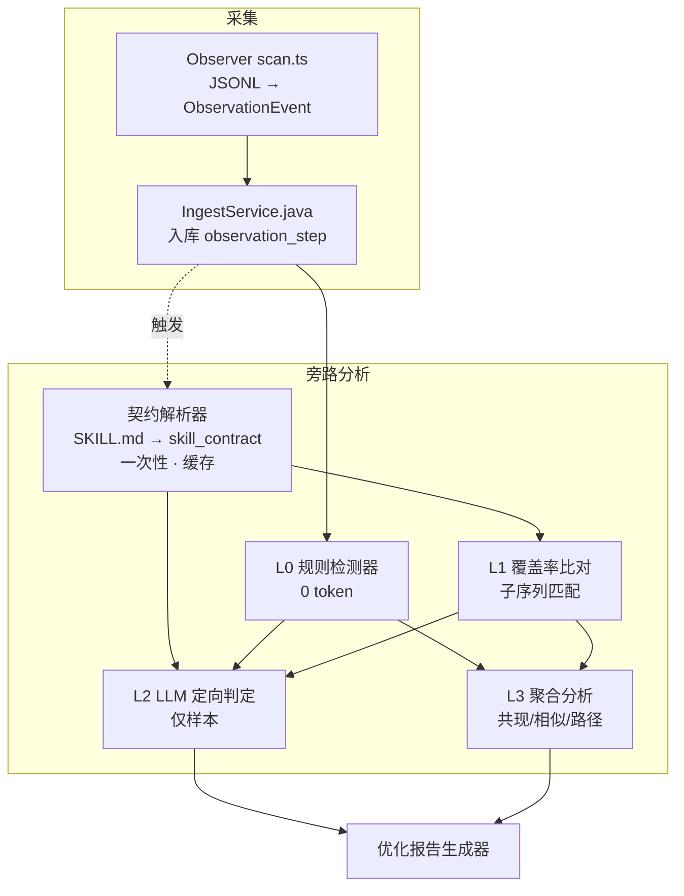

# Skill 观测分析与优化系统 —— 完整设计方案

> 版本：v1.0
> 适用范围：SkillHub 的 Observer 采集链路、观测后端（`ObservationRepository` / `ObservationIngestService`）与前端指标面板（`ObserveMetricsPanel.vue`）
> 目标读者：平台开发者、skill 维护者、观测系统二次开发人员

---

## 0. 文档约定

- **链路（trace）**：一次 agent 会话中，一个 turn 内按 `seq` 排序的 step 序列。step 类型见下。
- **step 类型**：`user` / `assistant` / `skill` / `tool` / `document`（与 `cli/observer/src/types.ts` 一致）。
- **skill step**：agent 命中某个 skill 的观测事件，payload 含 `name`、`path`、`args`、`outcome`、`match`（`call` / `file` / `path` / `text`）、`tool`、`usage`，复合包子级带 `rollup`、`child_slug`。
- **契约（contract）**：从某个 skill 的 `SKILL.md` 结构化出的"预期执行清单"，是本方案回答"是否执行完"的基准。
- **归因单位**：以 `(clientId, sessionId, turnIndex, stepId)` 为幂等键；skill 归因到 `skill_slug`（平台 slug）。

---

## 1. 背景与目标

### 1.1 现状与痛点

当前观测系统已经能把 agent 执行 skill 的完整过程采回来（session → turn → step 三级，含用户原文、助手回复、skill/tool/document 步、token 用量），并在前端呈现为指标面板与链路视图。但 skill 优化这件事**仍然依赖人工逐条看链路**，痛点如下：

1. **人工观察效率低**：要判断"agent 是否按 skill 描述执行、是否中途遗忘、是否命中多个 skill 后内容混合"，只能人肉打开每个 session 逐 turn 看，费时且不可规模化。
2. **指标答非所问**：现有"载入完整率""健康分"等指标衡量的是**触发方式**（agent 用什么方式引用了 skill），而不是**执行完整度**（skill 要求的步骤是否真的做完），导致看面板得不到可行动的结论。
3. **缺三个关键判断的自动化手段**：skill 本身是否有缺陷、多个相似 skill 是否互相冲突、skill 内容是否被完整执行、是否存在更快更省 token 的执行链路——这四个问题目前没有任何自动检测能力。

### 1.2 目标

本方案要交付的能力，用可度量方式表述：

| 编号 | 目标 | 可度量标准 |
| --- | --- | --- |
| G1 | 自动发现"可疑"回合，替代人工逐条看 | 人工只需审阅 ≤ Top-N 样本（默认每 skill 每周期 ≤ 20 个回合），全量回合由规则自动过滤 |
| G2 | 低 token 成本 | 检测主链路 0 token；LLM 仅作用于被标记样本，默认预算 ≤ 每 skill 每周期 1 次批处理、样本 ≤ 20、单样本上下文 ≤ 3k token |
| G3 | 回答"是否执行完整" | 输出 checklistCoverage（契约步骤覆盖率）与偏差动作列表 |
| G4 | 回答"是否冲突" | 输出 skill 共现矩阵 + 相似度 Top 对 + 冲突候选 |
| G5 | 回答"是否有更优路径" | 按任务意图聚类后，输出同任务不同触发链路的 median token / turn 对比 |
| G6 | 产出可行动的优化报告 | 每类发现绑定一条具体修改建议，落到"改哪个 skill、改哪一段" |

### 1.3 非目标（明确不做，防止范围膨胀）

- 不做通用 agent 行为审计平台，只聚焦 skill 执行质量。
- 不做实时拦截/强制干预（不在 agent 运行时阻断或改写其行为），只做**事后观测与建议**。
- 不做跨组织的数据联邦或多租户权限体系（沿用现有"无登录、按 clientId 区分"的约定）。
- 不追求单一"总分"排名，改为分层指标，避免误导性聚合。

---

## 2. 总体思路

### 2.1 核心原则

1. **确定性优先**：能用规则/SQL/字符串匹配判断的，绝不用 LLM。规则层承担"候选发现"，LLM 只承担"最终判定"。
2. **一次性成本**：SKILL.md 的契约化解析、catalog 的 embedding 相似度，都按 `(slug, version)` 做一次并缓存，后续所有 trace 复用，边际成本趋近于零。
3. **样本定向，而非全量**：LLM 不看整条链路，只看规则筛出的可疑样本，且输入是压缩后的摘要。
4. **可解释**：每个检测结论都携带证据（命中的规则 ID、缺失/偏差的具体步骤、引用的原始 step 摘要），人可回查原文。
5. **失败不阻塞主链路**：任何检测环节失败都降级，不影响采集与上传（ingest 是主链路，检测是旁路）。

### 2.2 分层检测架构

四层，成本从 0 到小，各层可独立上线：

```
L0  规则检测器        0 token   纯 SQL / TS 判定，产出「可疑回合候选池」
L1  契约覆盖率比对    近 0 token 契约(一次性解析) vs 观测 step 的子序列匹配
L2  LLM 定向判定      小 token  仅对 L0/L1 标记样本做结构化 yes/no 判定
L3  聚合分析          离线/批量 共现矩阵、embedding 相似度、路径成本对比
```



### 2.3 与现有系统的关系

- **不改造采集主链路**：`scan.ts` 的采集逻辑保持，只做**增量字段补充**（见 §4.3）。
- **后端检测作为旁路服务**：在现有 `observation` 包下新增 `ObservationAnalyzer`，复用 `ObservationRepository` 的数据访问，不侵入 `ObservationIngestService` 的入库事务。
- **指标面板改造**：把伪指标（健康分、载入完整率）替换为契约覆盖率与偏差计数，前端 `ObserveMetricsPanel.vue` 的 `quality` 字段来源改为新分析结果。

### 2.4 端侧职责划分（重要边界）

**原则：LLM 只出现在平台侧（后端），CLI 侧永远 0 token。**

| 职责 | CLI 侧（Observer） | 平台侧（后端） |
| --- | --- | --- |
| 采集 trace | ✅ `scan.ts`（JSONL → ObservationEvent，含 token 归因、版本识别） | — |
| 本地 HTML 报告 | ✅ `report.ts`（可选，纯规则级展示，不调 LLM） | — |
| A 契约提取（规则 + LLM） | ❌ | ✅ `SkillContractExtractor` |
| B L0 规则检测 | ❌ | ✅ `ObservationAnalyzer` |
| C L1 覆盖率 | ❌ | ✅ `ObservationAnalyzer` |
| D L2 LLM 定向判定 | ❌ | ✅ `ObservationAnalyzer` |
| E L3 聚合（共现/相似/路径） | ❌ | ✅ 后端离线任务 |
| F 报告生成 | ❌ | ✅ 后端 + 前端展示 |

**为什么契约提取与 LLM 判定都放平台侧**：

1. **契约是全局共享资产**：按 `(slug, version)` 只解析一次、被所有客户端上传的 trace 复用。放 CLI 侧会导致每台机器各自解析、成本乘客户端数、版本无法统一失效。
2. **数据亲和**：L2 判定需要同时访问全量观测数据（`observation_step`）与契约，二者都在平台侧，放平台侧天然衔接。
3. **成本与幂等管控**：LLM 配额、熔断、结果落 `skill_analysis` 表复用，必须在全局唯一后端统一管理，避免散落在各客户端不可控。

**CLI 侧 `catalog.ts` 的 `parseSkillFile` 只做"归因 + 版本识别"**（从 frontmatter 取 name/version、父子 rollup 归因），它**不是**契约提取，两者职责不同，不得混用。

---

## 3. 现状差距分析

### 3.1 现有数据资产盘点

| 层 | 位置 | 关键字段 | 对方案的价值 |
| --- | --- | --- | --- |
| 采集 | `cli/observer/src/scan.ts` | 五类 step、`match`、`outcome`、`rollup`、`skill_version_label`、`usage` | 触发方式、结果、版本、token 都已采到 |
| 归因 | `catalog.ts` | slug 归一化、复合包父子归因（`parentSlugsFor`）、已知复合包名单 | 已能区分父子，避免父子误判为冲突 |
| 入库 | `ObservationIngestService.java:30` | 幂等键 `(clientId, sessionId, turnIndex, stepId)`，payload 全量 JSONB | 数据完整，可重放 |
| 后端指标 | `ObservationRepository.java` | `skillQualitySummary` / `skillQuality` / `skillEvidenceLevels` / `skillTokenSummary` | 部分可直接复用，部分需重定义 |

### 3.2 能支撑 / 不能支撑

**能支撑（无需新增采集，即可计算）：**

- skill 触发次数、会话/客户端覆盖、7 日趋势、token 用量（input/cache/output/total/requests）。
- 硬错误率（`outcome='error'`）、同 turn 重读、skill 触发后是否"空转"（无后续 tool/document）。
- 多 skill 共现（同一 turn/session 内出现的 slug 组合）——只需查 `observation_step`。

**不能支撑（需要新增数据结构或字段）：**

| 想回答的问题 | 缺口 | 补齐方式 |
| --- | --- | --- |
| skill 内容是否执行完整 | 没有"预期步骤清单"，无法做"应做 vs 实做"比对 | 新增 `skill_contract`（§4.1、§5.1） |
| 是否存在相似/冲突 skill | 没有跨 skill 的相似度与共现分析 | 新增离线 embedding + 共现矩阵（§5.5） |
| 是否有更优执行链路 | 会话未按"任务意图"聚类，无法对比同类任务的路径成本 | 新增任务聚类 + 路径成本（§5.5） |
| 执行耗时 | tool step 的 `duration_ms` 在采集端恒为 `undefined`（`scan.ts:650`） | 采集端补 `duration_ms`（§4.3） |
| 真实错误 | Codex 端用 `/error/i` 只扫 result 前 80 字符（`scan.ts:589`），易误判 | 采集端补结构化 error 标志（§4.3） |

### 3.3 现有指标评审（结论先行，详见 §7）

| 指标 | 判定 | 核心缺陷 |
| --- | --- | --- |
| calls / sessions / clients / trend | 保留 | 客观，衡量采用度 |
| token 系列（input/cache/output/total/requests） | 保留 | 客观，衡量成本 |
| errorRate | 修正 | Codex 端错误判定口径不稳（`scan.ts:589`） |
| reloadRate（重读率） | 降级为信号 | `≥2` 阈值会误伤合法重读，不参与合成分 |
| loadCompleteRate（载入完整率） | **重定义** | 量的是 `match ∈ {file,path}`（触发方式），且把最规范的 `Skill` 工具调用（`match='call'`）判为"不完整"，方向反了（`ObservationRepository.java:387-388`） |
| progress（推进） | **删除/统一** | 两处公式不一致：summary 用 `complete/calls*0.5 + 0.5*(1-error)`（`:400`），detail 用 `avgToolsAfter/3`（`:477`） |
| healthScore（健康分） | **删除** | 权重（35/30/25/10）拍脑袋，且建立在上述两个伪指标上（`:401`） |

**结论**：现状数据**够做"采用度 + 成本 + 触发方式"观测，不够做"执行完整度/冲突/最优路径"分析**；现状指标中 `loadCompleteRate` 与 `healthScore` 是伪指标，需替换为 `checklistCoverage`。

---

## 4. 数据模型扩展

### 4.1 新增表 `skill_contract`

契约是"是否执行完整"的基准，按 `(slug, version_label)` 唯一，一次解析、全局复用。

```sql
CREATE TABLE skill_contract (
  id              BIGSERIAL PRIMARY KEY,
  slug            TEXT NOT NULL,                 -- 平台 skill slug
  version_label   TEXT NOT NULL,                 -- 归一化 SemVer（无前导 v，空串表示「无版本」）
  source_path     TEXT,                          -- 解析来源 SKILL.md 路径（可空，审计用）
  raw_hash        TEXT,                          -- SKILL.md 内容摘要，用于失效判断
  contract        JSONB NOT NULL,                -- 结构化契约（见附录 B schema）
  parse_method    TEXT NOT NULL,                 -- 'rule' | 'llm' | 'hybrid' | 'failed'
  parse_meta      JSONB,                         -- 解析过程元数据（置信度、消耗 token 等）
  created_at      TIMESTAMPTZ NOT NULL DEFAULT now(),
  updated_at      TIMESTAMPTZ NOT NULL DEFAULT now(),
  UNIQUE (slug, version_label)
);
```

契约 JSONB 核心字段（完整 schema 见附录 B）：

```jsonc
{
  "steps": [
    {
      "id": "s1",
      "title": "读取设计稿",
      "keywords": ["figma", "设计稿"],
      "expected_tools": ["Read"],
      "expected_artifacts": [".*\\.(fig|png|jpg)$"],
      "optional": false
    }
  ],
  "preconditions": ["存在 package.json"],
  "triggers": ["生成海报", "设计 UI"],
  "forbidden": ["直接修改生产配置"],
  "entry_commands": ["/skill-x"]
}
```

`parse_method='failed'` 表示解析失败（规则与 LLM 均失败），该 skill 不参与覆盖率计算，但**仍参与** L0 规则检测（错误/重读等）——降级但不静默。

### 4.2 新增表 `skill_analysis`（检测结果落库，避免重复计算）

```sql
CREATE TABLE skill_analysis (
  id             BIGSERIAL PRIMARY KEY,
  slug           TEXT NOT NULL,
  version_label  TEXT NOT NULL,
  analysis_type  TEXT NOT NULL,                 -- 'rule_hit' | 'coverage' | 'conflict' | 'llm_verdict' | 'path_cost'
  scope_key      TEXT NOT NULL,                 -- 分析对象的稳定键，见下
  result         JSONB NOT NULL,
  status         TEXT NOT NULL DEFAULT 'ok',    -- 'ok' | 'degraded' | 'failed'
  created_at     TIMESTAMPTZ NOT NULL DEFAULT now(),
  UNIQUE (slug, version_label, analysis_type, scope_key)
);
```

`scope_key` 说明：
- `rule_hit`：`turnId`（命中规则的那个 turn）。
- `coverage`：`turnId`。
- `llm_verdict`：`turnId`（与 coverage/rule_hit 关联，避免重复调用 LLM）。
- `conflict`：`skill_pair`（如 `"a|b"` 排序后拼接）。
- `path_cost`：`task_cluster_id`。

落库的意义：检测是**旁路且昂贵**（尤其 LLM），结果一旦算好即缓存，重复请求直接读表；也为报告提供可追溯的证据链。

### 4.3 采集端字段补充（`cli/observer/src/scan.ts`）

在 `makeEvent` 与 tool/document 事件构造处补字段，**向后兼容**（老数据缺字段按缺省处理）：

| 字段 | 位置 | 取值 | 用途 |
| --- | --- | --- | --- |
| `duration_ms` | skill step（`scan.ts:650` 处 `duration_ms: undefined`） | tool_use 与其 tool_result 的时间差，取不到则省略 | 路径耗时对比（G5） |
| `error` | skill step | 结构化布尔：Claude 取 `tool_result.is_error`，Codex 取 `function_call_output` 的结构化错误位，**不依赖文本正则** | 修正 errorRate（§7） |
| `tool`（tool step 补全名） | tool step | 已有 `name`，补 `tool_id`（call_id）用于与结果配对 | 更准的耗时与配对 |
| `seq`（结果回填） | 所有 step | 保持现有单调 seq | 已具备，无需改 |

关键改动点在 `scan.ts`：
- 第 `345-360` 行（Claude tool_result 回填）：`event.payload.outcome = item.is_error ? 'error' : 'ok'` 已用结构化 `is_error`，保留；新增 `event.payload.error = Boolean(item.is_error)` 统一字段。
- 第 `580-592` 行（Codex output 回填）：把 `event.payload.outcome = /error/i.test(result.slice(0, 80)) ? 'error' : 'ok'` 改为优先读 `payload` 中的结构化错误字段，仅在其缺失时才回退文本启发式，并把文本窗口从 80 放宽到全量（`sanitizeText` 已保证安全）。

### 4.4 迁移与兼容

- 两处新表通过 Flyway 新增迁移脚本（现有 `V1-V5` 之后，命名 `V6__skill_analysis.sql`）。
- 新字段不进幂等键，不影响现有 `(clientId, sessionId, turnIndex, stepId)` 幂等。
- 历史数据无 `error`/`duration_ms`：覆盖率与规则检测仍可用（依赖 `outcome`/`match`/`seq`），仅"真实错误率"与"耗时"对老数据回退为空，前端展示"部分指标待新数据"。

---

## 5. 详细实现流程

本章是方案主体。六个阶段（A–F），每阶段给出：输入、处理步骤、输出、伪代码/关键 SQL、成本与失败处理。

### 5.1 阶段 A：契约提取（SKILL.md + 同包引用资源）

**端侧**：平台侧（后端 `SkillContractExtractor`），CLI 不参与。触发时机：skill 上传/发布时；或检测时发现 `skill_contract` 缺失或 `raw_hash` 与当前内容不一致（失效重算）。

**契约粒度（复合包）**：契约按**叶子子 skill（sub-skill）**建立，不按复合父包建立。父级（如 `superpowers`）只是目录容器，无独立执行流程，观测归因也已 rollup 到子级 slug；父级不建契约、不参与覆盖率，仅参与共现统计（父子共现不算冲突，见 R4）。

**输入（引用驱动，兼容所有 skill）**：`SKILL.md` 是**唯一恒定的基线**——它是 skill 规范强制要求、每个 skill 都有的入口；同包资源（references/scripts/data 等）是**可选的**，不是所有 skill 都有。因此"读哪些文件"必须由**引用驱动**，而不是按目录名猜测：

1. **恒读** `SKILL.md` 全文——这是所有 skill 的公共部分。
2. **增量纳入**：扫描 `SKILL.md` 正文与代码块中被显式引用的**同包相对路径**（`references/…`、`scripts/…`、`./…`、`../…` 及反引号命令中的脚本路径），命中的文件才读取；**未被引用的文件一律不读**。
3. 目录名（`references`/`scripts`/`data`）只用于**内容类型判别**（决定"全文 / 帮助文本 / 表头"），**不是发现规则**——资源可能放在任意目录名，也可能完全没有。

按命中文件的类型分层纳入、控制 token：

| 命中的资源 | 纳入方式 | 理由 |
| --- | --- | --- |
| `SKILL.md` | 全文（恒读） | 唯一强制基线 |
| 被引用的 markdown（如 `references/*.md`） | 全文（截断至 16k/文件） | 规则的真正载体 |
| 被引用的脚本（如 `scripts/search.py`） | 仅 argparse 帮助文本 + 模块 docstring | 代码主体与"该做什么"无关，且量大 |
| 被引用的数据（如 `data/*.csv`） | 仅表头 + 首行样例 + 行数 | 数据用于检索，不构成流程步骤 |
| 引用的外部 URL / 绝对路径 | 跳过 | 同包外资源，平台不持有，也不应外抓 |

**形态谱系与兼容性**（每种都落入上述规则，天然兼容）：

| 形态 | 实例 | 引用发现结果 | 处理 |
| --- | --- | --- | --- |
| 纯自包含 | `token-efficient-development` | 空 | 只读 SKILL.md，零额外开销 |
| 正文引用 references | `ui-ux-pro-max`（正文明确写 `read references/…`） | 命中 references | 增量纳入 markdown 全文 |
| 命令引用脚本/数据 | 形如 `python scripts/search.py …` | 在代码块/反引号命令中命中 | 脚本取帮助文本、数据取表头 |
| 复合包 | `superpowers` 等 | 父级无统一根 SKILL.md | 拆叶子子 skill，各自回到上述三种形态 |
| 引用外部资源 | 任何引用 URL 者 | 命中但同包外 | 跳过 |

**边界取舍（保守策略）**：引用驱动**宁可漏纳入、不可误纳入**。漏纳入的代价是契约可能不完整（由 LLM 兜底与 `GET /skills/{slug}/contract` 调试接口补救）；误纳入的代价是把无关数据（如 79 个 styles 的全量 CSV）塞进契约，污染契约并烧 token，代价更大。

**说明**：上一版"不能只取根 SKILL.md，流程往往散在同包资源里"是仅基于 `ui-ux-pro-max` 单一样本的过度泛化，本版已修正为"SKILL.md 恒定基线 + 引用驱动增量"。

**兼容性真正的瓶颈不在"读哪些文件"，而在"规则解析器能否从任意结构的 SKILL.md 提取步骤"**。SKILL.md 没有强制的结构规范：标题层级、列表风格、是否用 checkbox 都因作者而异。因此跨 skill 兼容靠三点保证：(1) 规则解析器不假设固定结构，只认标题/列表/checkbox 等**通用标记**；(2) 置信度自评，低置信自动转 LLM；(3) 解析失败降级为 `parse_method='failed'` 而不报错中断。这三点才是保证"对所有 skill 都兼容"的关键，而非"读更多文件"。

**处理步骤**（两级，规则优先）：

1. **规则解析（0 token）**：
   - frontmatter：`name`、`description`、`version`（复用 `catalog.ts` 的 `frontmatterField` 逻辑，提取 `triggers`）。
   - 步骤清单：解析二级/三级标题（`## 步骤` / `### Step 1`）与有序/无序列表项、checkbox（`- [ ]` / `1.`）。
   - 工具名：正文与代码块中反引号包裹的命令/函数名（`\`(\w+)\``），脚本帮助文本中的子命令/参数名。
   - 产物模式：形如 `输出 xxx.md`、`生成 foo.json` 的语句提取文件名模式。
   - **置信度自评**：若步骤数 ≥ 1 且每个步骤都有 `title` 或 `keywords`，判定 `parse_method='rule'`，结束；否则进入第 2 步。

2. **LLM 解析（一次性，每版本一次，平台侧）**：
   - 仅在规则解析置信度不足时触发。
   - 输入：合并后的 `SKILL.md + 引用资源`（总截断至 16k 字符，超限按 `SKILL.md > references > scripts > data` 优先级截断）+ 附录 C 的提取 prompt。
   - 输出：严格按附录 B schema 的 JSON。
   - `parse_method='llm'`，`parse_meta` 记录 `token_used`、`model`、`confidence`。

3. **失败兜底**：LLM 输出 JSON 校验失败 → 重试 1 次 → 仍失败则 `parse_method='failed'`，该版本不参与覆盖率，但记录到 `parse_meta.error` 供人工排查。

**输出**：写入 `skill_contract`（`raw_hash` 用于失效；`raw_hash` 应覆盖"SKILL.md + 全部纳入资源"的内容摘要，而非仅 SKILL.md）。

**成本模型**：N 个 skill × 每版本 1 次 LLM（多数 skill 走规则解析，实际 LLM 占比预计 < 30%）。之后 M 次 trace 全复用，**边际 token = 0**。

**关键实现点**：解析器放后端 `observation` 包新增 `SkillContractExtractor`；规则解析用纯 Java（复用现有 `ObservationPayloads` 的文本清理），LLM 解析通过配置的模型端点调用（独立注入，缺省关闭）。复合包需先按 `catalog.ts` 的 `parentSlugsFor`/rollup 归因关系拆分叶子子 skill，再逐个子 skill 建契约。

### 5.2 阶段 B：L0 规则检测器（0 token）

**触发时机**：ingest 完成后异步触发，或定时批处理；也可按需对 `skillDetail` 请求即时计算并落 `skill_analysis`。

**输入**：`observation_step` 按 turn 聚合的序列。

**规则清单**（完整定义见附录 A，这里给核心判定与 SQL 思路）：

| ID | 名称 | 判定（基于一个 turn 内的 step 序列） | 严重级别 |
| --- | --- | --- | --- |
| R1 | 硬失败 | 存在 `type='skill'` 且 `payload.outcome='error'` | P0 |
| R2 | 空转 | 存在 skill step，但该 turn 内其后**无任何** `type IN ('tool','document')` 步 | P1 |
| R3 | 同 turn 重读 | 同 slug 的**非 rollup** skill step 数 ≥ 2（`scan` 端的 rollup 父子不算） | P2 |
| R4 | 多 skill 混合 | 同 turn 内**不同 slug**（排除 rollup 父子、排除已知复合包父级）≥ 2 | P1 |
| R5 | 超长 turn | turn 内 step 数 > P95（或 token > P95） | P2 |
| R6 | 契约顺序违背 | 契约步骤出现但顺序与 `steps` 顺序不一致（需契约，见 §5.3） | P1 |
| R7 | 契约遗漏 | 契约非 optional 步骤缺失（需契约，见 §5.3） | P1 |
| R8 | 偏差动作 | 观测到契约外动作（需契约，见 §5.3） | P2 |
| R9 | 版本漂移 | `skill_version_label` 与平台最新发布版本不一致 | P3 |

**R4 的父子归因去重**（关键，避免误报）：`catalog.ts` 的 `parentSlugsFor` 已能识别父子关系；检测时维护 `(slug → parentSlug)` 映射，同一复合包父子共现**不算**冲突，只对"两个互不为父子、且都不属于已知复合包父级"的 slug 对计数。

**输出**：`skill_analysis` 行（`analysis_type='rule_hit'`），`result` 含 `rule_id`、`turn_id`、`evidence`（命中的 step_id 列表与 payload 摘要）。

**实现形式**：SQL 可表达 R1–R5 的粗筛（在 `ObservationRepository` 加 `findCandidateTurns`），R6–R8 依赖契约、放 `ObservationAnalyzer` 的 Java 逻辑（因为要 join `skill_contract`）。全部 0 token。

### 5.3 阶段 C：L1 契约覆盖率比对

**输入**：某 turn 的观测 step 序列 + 该 slug 的 `skill_contract.steps`。

**处理步骤**：

1. **观测动作抽取**：把 turn 内该 skill 之后的 `tool`/`document` 步，归一化为"动作"：
   - `tool` 步 → `{tool: name, args_terms: extractPaths(args) + 关键词}`
   - `document` 步 → `{doc: path, keywords}`
2. **契约步骤匹配**：对每个契约 step，判断是否被某观测动作命中：
   - `expected_tools` 含观测动作的工具名 → 命中；
   - `expected_artifacts` 正则匹配 `document.path` 或 tool 参数路径 → 命中；
   - `keywords` 出现在动作 args/result 摘要中 → 命中（规则匹配）。
   - 规则匹配都不中，且开启 LLM 时 → 降级用 embedding 余弦（离线算好，见 §5.5）。
3. **子序列顺序**：按契约 `steps` 顺序检查命中的先后，若命中顺序与契约顺序不一致 → 标记 `order_violation`（对应 R6）。
4. **计算覆盖率**：
   - `covered = 命中的非 optional 步骤数`
   - `total = 非 optional 步骤总数`
   - `checklistCoverage = covered / total`（total=0 时跳过，标记 `no_contract`）
   - `deviations = 观测动作中未命中任何契约步骤的动作`（对应 R8）。

**输出**：`skill_analysis`（`analysis_type='coverage'`），`result` 含 `checklistCoverage`、`matched[]`、`missed[]`、`deviations[]`、`order_violation`。

**复杂度**：每 turn O(观测动作数 × 契约步骤数)，契约步骤通常个位数，成本可忽略。

**边界**：契约步骤可能是**并行/可选**的（skill 允许任意顺序）。方案在 schema 里保留 `optional` 与 `parallel_group`（附录 B），`parallel_group` 相同的步骤不强制顺序——避免对"合法乱序"误报。

### 5.4 阶段 D：L2 LLM 定向判定

**端侧**：平台侧（后端 `ObservationAnalyzer`），CLI 不参与。需要同时访问全量观测数据与契约，且判定结果要落 `skill_analysis` 表供全局复用，故必须在后端。

**触发条件**：L0 命中 P0/P1 规则，或 L1 覆盖率 < 阈值（默认 0.6）的 turn。**只对这些样本调用 LLM。**

**输入构造（压缩，控制 ≤ 3k token/样本）**：

```
[契约摘要] slug + steps 的 title/keywords/expected_tools（不含全文）
[观测摘要] turn 内按 seq 的 step 列表：
  每个 step 只保留 {type, name/path, args 前 200 字符, result 前 200 字符, outcome}
[问题] 封闭式，见附录 C
```

**输出**（结构化 JSON，强制 schema）：

```jsonc
{
  "turn_id": "...",
  "verdict": "complete | partial | failed | conflicted",
  "missed_steps": ["s2"],
  "extraneous_actions": ["执行了非契约动作 X"],
  "conflict_with": ["other-slug"],   // 判定为冲突时填写
  "evidence": ["step#5 显示 ..."],
  "confidence": 0.0
}
```

**批处理与预算（样本上限是跨客户端全局的，不是每客户端一份）**：
- **全局分母**：候选池 = 该 `(slug, version)` 下**所有客户端汇聚后的**可疑 turn，不是某台机器的。数据上线后，多个客户端（Windows/macOS/Linux 各若干台）的 trace 都会进入同一个池子。
- **全局采样上限**：默认每个 `(slug, version)` 每周期（7 天）最多送 LLM **20 个样本，跨客户端合计**，与客户端数量**无关**。客户端从 6 台涨到 600 台，LLM 判定预算不变。
- **采样策略**（在全局候选池上做，而非逐客户端做）：
  1. **失败模式去重**：先按 `(ruleId + 缺失步骤集合 + 错误关键词)` 聚类，同一失败模式只保留 1 个代表样本——避免 6 台机器触发同一个 bug、LLM 判 6 次。
  2. **分层代表**：去重后若仍有富余，按客户端分层各取代表，保证"平台/环境相关"的问题不被单一客户端淹没（例如某个 bug 只在 Windows 出现，抽样必须保留 Windows 样本）。
  3. **优先级截断**：按严重级别（P0 > P1 > P2）与 token 从高到低截断至 20。
- **幂等与缓存**：结果落 `skill_analysis`（`analysis_type='llm_verdict'`），以 `turnId` 为 `scope_key` 全局唯一，**同 turn 只判一次**；`turnId` 天然含 `clientId` 前缀（见 §6.1），跨客户端不冲突、不重复。
- 缺省**关闭**，通过配置开启（`skillhub.analysis.llm.enabled`），无模型端点时自动跳过，仅回退 L0/L1 结论。

**token 量级估算（假设 K 个客户端、每周期全局候选 turn 数 N）**：
- L2 判定 token = **min(N, 20) × 每样本 ≤3k**（去重后），与 K 无关，只与"去重后的失败模式数"相关。
- 契约解析 + embedding = 每 `(slug, version)` 一次，与 K 无关。
- 结论：**LLM 成本是 O(skill 版本数 + 去重后失败模式数)，不是 O(K × turn)**。

**价值**：把 L0/L1 的"疑似"升级为"确认"，并补充 `conflict_with`（哪个 skill 混入）与 `evidence`（可回查），降低误报，同时 token 被约束在样本级。

### 5.5 阶段 E：L3 聚合分析

三个子分析，均离线/批量：

**E1 共现矩阵（冲突候选）**：
- 统计同 turn / 同 session 内出现的 slug 对，做父子归因去重。
- 指标：共现次数 + Jaccard（`|A∩B| / |A∪B|`，用调用过的 session 集）。
- 高共现 + 高相似度（见 E2）→ 冲突候选。
- 纯 SQL 可算，0 token。

**E2 相似度（相似 skill 候选）**：
- 对 catalog 中每个 skill 的 `name + description + SKILL.md 首段`做 embedding（离线，一次，按 `(slug,version)` 缓存）。
- 两两余弦相似度 Top-K，与 E1 结果交叉。
- 说明：embedding 依赖模型端点，缺省关闭；未开启时退化为"name/slug 编辑距离 + description 关键词重叠"的弱相似度（0 token 兜底）。

**E3 路径成本（更优链路）**：
- 任务聚类：用 `session_title` / `user_text` 首条（复用 `ObservationRepository` 已有的 `SESSION_TITLE_JOIN` 与 `cleanSessionTitleText`）聚类同类任务；embedding 可用时按 user_text 聚类，否则按标题关键词分桶。
- 对每个任务簇，枚举不同 skill 触发序列（skill slug 出现顺序），统计 `median(turn tokens)`、`median(steps)`、`median(duration_ms)`。
- 输出：同任务下"路径 B 比 A 省 X% token"的对比表。

**输出**：`skill_analysis`（`analysis_type='conflict'` / `'path_cost'`）。

### 5.6 阶段 F：报告生成与修改建议

**输入**：`skill_analysis` 汇总 + `skill_contract` + 现有 `skillQuality`/`skillTokenSummary`。

**三类报告**（对应 G3–G6）：

1. **单 skill 质量报告**：
   - 采用度（calls/sessions/trend）、成本（token 分位）、执行质量（errorRate、checklistCoverage、偏差、重读信号）。
   - 问题清单：每个 `llm_verdict`/`rule_hit`/`coverage` 结论 + 证据（可跳转原文 turn）。
   - **修改建议模板**（映射到具体动作）：
     - 覆盖率低/`missed_steps` 多 → 建议改写 SKILL.md 中对应步骤的描述，使其更醒目（给步骤标题与建议措辞）。
     - `extraneous_actions` 多 → 建议在 SKILL.md 增加"禁止项"（写入 `forbidden`）。
     - `conflict_with` → 进入冲突报告。
     - `order_violation` 频繁 → 建议在步骤前加"必须按顺序"或把 `parallel_group` 声明清楚。

2. **冲突报告（跨 skill）**：共现 + 相似度 Top 对，每对给：合并 / 改触发词 / 加边界条件（"当 A 时用 X，当 B 时用 Y"）三类建议。

3. **效率报告（路径）**：同任务不同路径的 token/turn 对比，指出最优路径，建议把最优触发序列写进 skill 的推荐用法段落。

**报告落点**：复用前端 `skillDetail` 的 `quality`/`evidence` 结构，新增 `analysis` 区块；或独立生成 Markdown/HTML 报告文件（可选）。

---

## 6. 健壮性设计

### 6.1 幂等与去重

- **入库幂等**：沿用现有 `(clientId, sessionId, turnIndex, stepId)` 与 `ON CONFLICT` 策略（`ObservationIngestService` / `ObservationRepository.upsertStep`），新字段不改变键，重复上传安全。
- **检测幂等**：`skill_analysis` 以 `(slug, version_label, analysis_type, scope_key)` 唯一，重算覆盖而非追加；LLM 判定同一 `turnId` 只算一次。
- **契约幂等**：`skill_contract` 以 `(slug, version_label)` 唯一，`raw_hash` 不变则跳过重解析。

### 6.2 缓存与失效

- **契约失效**：SKILL.md 内容变更（`raw_hash` 变化）或新版本发布 → 标记旧契约失效，下次检测重解析。历史 trace 对应旧版本的契约仍保留（`version_label` 区分），保证**历史可回溯**。
- **embedding 失效**：skill 描述/正文变更时重算对应条目，其余复用。
- **LLM 判定缓存**：`scope_key=turnId` 的结果长期有效（观测数据是追加式，turn 内容不溯改；若源 jsonl 因 reconcile 重传产生更长 payload，见 6.4 的重算策略）。

### 6.3 失败降级（旁路原则）

检测是旁路，任何环节失败都不应影响采集、上传与指标页的可用性（与现有 `skillDetail` 的 `degraded` 兜底一致）：

| 环节 | 失败行为 |
| --- | --- |
| 契约规则解析失败 | 尝试 LLM；仍失败 → `parse_method='failed'`，该版本跳过覆盖率，保留 L0 检测 |
| 契约 LLM 解析失败 | 重试 1 次 → 降级 `failed` |
| L0/L1 计算异常 | 返回空候选，记录 `skill_analysis.status='failed'`，不抛到上层 |
| LLM 端点不可用 | 关闭 L2，仅用 L0/L1 结论，报告标注"未做 LLM 复核" |
| embedding 不可用 | 退化为规则相似度（编辑距离 + 关键词） |

### 6.4 数据质量与边界

- **时序缺失/乱序**：step 按 `seq` 而非 `ts` 排序做序列分析（`ts` 仅用于展示与耗时）；`ts` 缺失时 `duration_ms` 省略，不阻断。
- **超长内容**：已有 `sanitizeText`/`truncatePayloadValue`（后端 `SESSION_CHAIN_MAX_FIELD_CHARS=4000`），LLM 输入用摘要而非全文（§5.4），双保险。
- **二进制/NUL**：已有 `ObservationPayloads.sanitize`（Java）与 `payload.ts`（TS）处理，契约解析与 LLM 输入复用其产物。
- **脏数据**：`type` 非法值在 ingest 已抛错拒收（`ObservationIngestService.typeOf`），检测端对未知类型按 `tool` 兜底跳过。
- **reconcile 重传导致 payload 变长**：观测 step 的 upsert 已保留更长 payload（`length(EXCLUDED.payload) >= length(...)`），因此 `skill_analysis` 的 `scope_key` 加入 `step_count` 或 payload 长度摘要，变化时标记重算（避免"旧结论"与"新数据"不一致）。

### 6.5 隐私与安全

- **不新增采集面**：只对已采集的 step 做分析，不额外采集新的用户文本。
- **LLM 输入脱敏**：进入 L2 前，对 `user_text`/`result` 做正则脱敏（邮箱、密钥、token、绝对路径中的用户名），仅保留判断所需的结构化信息。
- **本地优先**：L0/L1 全在后端本地计算，不涉外；仅 L2/L3-embedding 在**显式开启**时调用外部模型，配置默认关闭。
- **输出安全**：报告中的证据字符串沿用前端现有 `escapeHtml` 渲染（`report.ts:211`）与后端 JSON 序列化，防注入。

### 6.6 性能与配额

- **批处理而非实时**：L0/L1 可由 ingest 异步触发或定时批量，避免放大请求延迟；`skillDetail` 优先读 `skill_analysis` 缓存，未命中才计算。
- **LLM 配额保护（全局固定，不随客户端数线性增长）**：每日 token 预算（默认 50k）、每个 `(slug, version)` 每周期样本上限（20，跨客户端合计）、并发上限（2）、失败熔断（连续 3 次失败暂停该 skill 的 L2 24 小时）。样本上限与去重见 §5.4。
- **聚合预计算**：E1/E2/E3 为离线任务，结果落表，前端只读汇总。
- **token 成本与规模无关的关键设计**：契约提取（A）、embedding（E2）都按 `(slug, version)` 全局一次并缓存；L0/L1/E1/E3 都是 0 token 的本地计算。全链路唯一随数据规模变化的 token 只有 L2，而 L2 被"全局样本上限 + 失败模式去重"锁定为常数预算（§5.4）。

### 6.9 多客户端汇聚的规模性

上线后，同 skill 同版本下多台客户端（Windows/macOS/Linux）的 trace 汇聚到平台同一数据池。方案对规模的支撑分三类：

**A. token 成本：与客户端数无关（已锁定）**。契约提取、embedding 按 `(slug, version)` 全局一次；L2 判定是全局采样上限（§5.4）。详见 §6.6 末条。

**B. 0-token 计算量：随数据量线性增长，但可批处理/增量**。L0/L1/E1/E3 都是 SQL/规则计算，不烧 token，但要避免在请求路径上全量重算：

| 措施 | 说明 |
| --- | --- |
| 增量计算 | ingest 完成后只对新 turn 跑 L0/L1，结果增量写入 `skill_analysis`，不重算历史 |
| 时间窗口 | 候选发现默认只看近 N 天（如 14 天），历史数据不进候选池 |
| 索引 | `observation_step(turn_id, seq)`、`(skill_slug, type)`、`(ts)` 建复合索引，支撑按 turn/skill/时间过滤 |
| 分区 | `observation_step` 按时间范围分区（如按月），旧分区冷存，检测只扫热分区 |
| 物化 | 共现矩阵（E1）可定期物化，不每次全表扫 |

**C. 存储与去重：已有幂等，补保留策略**。`observation_step` 幂等键 `(clientId, sessionId, turnIndex, stepId)` 已保证重复上传不膨胀；`skill_analysis` 按 `(slug, version, analysis_type, scope_key)` 唯一，检测结果不重复落。需补的只有**保留策略**：原始 step 的 payload 全文与检测结论的保留时长（如原始 90 天、结论 180 天），超期归档或降采样，避免长期无限增长。

**D. 客户端维度下钻**：汇聚不意味着丢失客户端身份。观测数据已带 `client_id`（现有 `skillDetail` 已按客户端列出 `clients`），质量/成本指标可按客户端下钻，便于区分"某 skill 在 Windows 上特有 bug"与"全平台普遍问题"。这是汇聚数据的价值，不是负担。

### 6.7 误报/漏报控制

- **两层架构天然控误报**：规则层追求**高召回**（宁可多标），LLM 复核追求**高精度**（确认/否决）。报告区分"疑似（L0/L1）"与"确认（LLM）"，人工只看确认 + 高严重疑似。
- **父子归因去重**（§5.2 R4）：避免复合包父子被误判为冲突。
- **合法乱序豁免**：契约 `parallel_group` 相同步骤不判 `order_violation`。
- **阈值可配置**：覆盖率阈值、P95 分位、样本上限均配置化，按真实数据调参。

### 6.8 复合包与版本漂移

- **复合包**：`rollup` 父级不计入覆盖率/重读/冲突计数；子级归属真实 slug，版本取子级自身版本（`catalog.ts:resolveSkillVersion` 已处理）。
- **版本漂移（R9）**：观测到的 `skill_version_label` 与平台 `skill_version` 最新发布不一致时标记，提示"用户在用旧版本，优化建议可能已在新版修复"，避免对旧版本重复提建议。

---

## 7. 指标重构方案

### 7.1 指标去留表（终版）

| 指标 | 动作 | 说明 |
| --- | --- | --- |
| calls / sessions / clients / turnCount | 保留 | 采用度 |
| trend（7 日） | 保留 | 趋势 |
| token 系列（input/cache_read/cache_write/output/total/requests） | 保留 | 成本 |
| errorRate | 修正 | 改用 §4.3 的 `error` 结构化字段；对老数据回退 `outcome='error'`，前端标注口径 |
| reloadRate / reloadTurns | 降级为信号 | 保留展示，但不进任何合成指标，标注"信号非结论" |
| loadCompleteRate（载入完整率） | 重定义 | 改为"触发方式分布"（call/file/path/text 占比），不再冒充"完整率" |
| progress（推进） | 删除 | 两处公式不一致，且可被覆盖率替代 |
| healthScore / healthLabel | 删除 | 伪指标，替换为 `checklistCoverage` + 分层视图 |
| evidence L1–L4 | 保留但改定义 | L1 触发、L2 契约覆盖、L3 有产出、L4 无硬失败无重读（见下） |

### 7.2 新指标定义与公式

**核心新指标 `checklistCoverage`（契约覆盖率）**：

```
checklistCoverage = 命中的非 optional 契约步骤数 / 非 optional 契约步骤总数
（无契约或 total=0 时返回 null，前端显示「无契约，无法评估」）
```

**evidence 漏斗（替换原 L1–L4，语义改为执行链路）**：

| 层 | 含义 | 判定 |
| --- | --- | --- |
| L1 | 触发 | turn 存在该 skill 的 step |
| L2 | 完整覆盖 | `checklistCoverage >= 阈值`（默认 0.8） |
| L3 | 产生后续动作 | skill step 之后存在 tool/document 步 |
| L4 | 闭环无异常 | L3 且 `error=0` 且同 turn 重读 < 2 |

**分层展示（不再合成单一分数）**：前端按三组呈现——采用度、执行质量（errorRate + checklistCoverage + 偏差数 + 重读信号 + 漏斗）、成本（token 分位 + 请求数）。每组可单独排序，避免"一个分数掩盖问题"。

---

## 8. 接口与报告设计

### 8.1 API 设计（新增，均在 `/api/observations` 下）

| 方法 | 路径 | 说明 | 返回 |
| --- | --- | --- | --- |
| GET | `/skills/{slug}/analysis` | 单 skill 的完整分析（复用 §5.6 报告结构） | `{skill, kpis, quality, analysis, report}` |
| POST | `/skills/{slug}/analyze` | 手动触发该 skill 的 L0/L1（可选 `?llm=true` 触发 L2） | `{jobId}`（异步）或同步结果 |
| GET | `/skills/{slug}/contract` | 查看/调试该 skill 的契约 | `skill_contract.contract` |
| GET | `/analysis/conflicts` | 跨 skill 冲突报告（E1+E2 汇总） | `{pairs: [{a,b,cooccur,jaccard,similarity,suggestion}]}` |
| GET | `/analysis/paths?task=...` | 路径成本对比（E3） | `{clusters: [{task, paths:[{sequence, medianTokens, medianSteps, medianDurationMs}]}]}` |

`POST analyze` 设计为**异步 + 幂等**：返回 `jobId`，结果写入 `skill_analysis`，前端轮询或一次性读取；重复提交同一 `(slug,version)` 返回同一 `jobId`。

### 8.2 报告结构（单 skill `analysis` 区块 JSON 骨架）

```jsonc
{
  "contract": { "hasContract": true, "stepCount": 5, "parseMethod": "rule" },
  "coverage": {
    "checklistCoverage": 0.6,
    "matched": ["s1", "s3", "s4"],
    "missed": ["s2", "s5"],
    "deviations": ["额外执行了 build 动作"],
    "orderViolation": false
  },
  "ruleHits": [ { "ruleId": "R2", "severity": "P1", "turnId": 123, "evidence": "..." } ],
  "llmVerdicts": [ { "turnId": 123, "verdict": "partial", "missedSteps": ["s2"], "confidence": 0.9 } ],
  "conflicts": [ { "with": "other-slug", "cooccur": 12, "similarity": 0.81, "suggestion": "..." } ],
  "paths": [ { "task": "生成海报", "sequence": ["ui-ux-pro-max"], "medianTokens": 12000 } ],
  "suggestions": [ { "target": "SKILL.md §步骤2", "kind": "rewrite-step", "detail": "..." } ]
}
```

---

## 9. 实施路线图与里程碑

| 阶段 | 内容 | 交付物 | 依赖 | 风险等级 |
| --- | --- | --- | --- | --- |
| M1 指标止血 | 删 `healthScore`/`progress`，重定义 `loadCompleteRate`，修 error 口径，前端分层展示 | 后端指标 + 前端面板改造 | 无 | 低 |
| M2 契约基础 | `skill_contract` 表 + `SkillContractExtractor`（规则解析，LLM 可选） | 契约提取 + 调试接口 | M1 | 低 |
| M3 L0 检测 | `findCandidateTurns` + `ObservationAnalyzer` 规则引擎（R1–R5，R6–R8 依赖 M2） | 可疑回合候选池 + 落库 | M2 | 低 |
| M4 L1 覆盖率 | 契约匹配 + `checklistCoverage` + evidence 漏斗替换 | 执行完整度指标 | M2 | 中 |
| M5 L2 LLM 复核 | 样本选择 + 脱敏 + 批处理 + 配额熔断 | 定向判定 | M3/M4 | 中 |
| M6 L3 聚合 | 共现矩阵 + 相似度 + 路径成本 | 冲突/效率报告 | M2 | 中 |
| M7 报告闭环 | 汇总三类报告 + 修改建议生成 + 前端呈现 | 完整优化报告 | M4/M5/M6 | 中 |

每个里程碑可独立上线、独立回滚；M1 先行止血，M2–M3 快速见效，M5/M6 为增强项（缺省关闭 LLM 也能得到 M1–M4 的核心价值）。

---

## 10. 风险与权衡

| 风险 | 影响 | 缓解 |
| --- | --- | --- |
| 契约解析不准（规则解析误提取步骤） | 覆盖率失真 | 规则解析带置信度，低置信走 LLM；`parallel_group` 豁免合法乱序；契约提供调试接口供人工校准 |
| LLM 判定幻觉 | 误报"冲突/遗漏" | L2 只做封闭式判定 + 强制 JSON schema + 证据回填；结论可回查原文，人工终审 |
| 父子归因错误导致误判冲突 | 复合包被拆成冲突 | 复用 `catalog.ts` 父子映射；R4 显式排除父子；E1 同样去重 |
| 旧数据缺 `error`/`duration_ms` | 新指标部分为空 | 新字段向后兼容，老数据回退 `outcome`；前端标注"待新数据" |
| LLM/embedding 成本失控 | 超预算 | 配额 + 熔断 + 样本上限 + 缺省关闭（§6.6） |
| 检测延迟拖慢指标页 | 体验下降 | 结果落 `skill_analysis` 缓存；`skillDetail` 读缓存优先；重算走异步（§6.6） |
| 隐私泄漏到外部模型 | 合规风险 | 默认关闭外部调用；开启时强制脱敏（§6.5） |

**总体权衡**：本方案用"确定性规则 + 一次性契约 + 样本级 LLM"换取**低成本、可解释、可规模化**的 skill 优化闭环，牺牲的是"每一回合都有人类级精确判断"——但通过样本定向 + 人工终审，把精度损失控制在可接受范围，并把人工从"全量逐条看"降为"只看 Top-N 样本"。

---

## 附录 A：L0 规则清单（完整定义）

> 每条规则给出：id、触发条件、严重级别（P0 必看 / P1 重要 / P2 提示 / P3 参考）、是否依赖契约、伪判定。

| id | 规则 | 依赖契约 | 级别 | 判定伪代码 |
| --- | --- | --- | --- | --- |
| R1 | 硬失败 | 否 | P0 | `∃ s∈steps: s.type=='skill' && s.payload.outcome=='error'` |
| R2 | 空转 | 否 | P1 | `∃ s∈steps: s.type=='skill' && ∄ t∈steps: t.seq>s.seq && t.type∈{tool,document}` |
| R3 | 同 turn 重读 | 否 | P2 | `count(s.type=='skill' && !s.payload.rollup && s.skill_slug==X) >= 2` |
| R4 | 多 skill 混合 | 否 | P1 | `|{s.skill_slug : s.type=='skill' && 互不为父子 && 非复合包父级}| >= 2` |
| R5 | 超长 turn | 否 | P2 | `len(steps) > P95(len) \|\| turnTokens > P95(tokens)` |
| R6 | 契约顺序违背 | 是 | P1 | 命中的契约步骤顺序与契约 `steps` 顺序不一致（`parallel_group` 内豁免） |
| R7 | 契约遗漏 | 是 | P1 | `∃ step∈contract.steps: !step.optional && step ∉ matched` |
| R8 | 偏差动作 | 是 | P2 | `∃ action∈observed: action ∉ 任何契约步骤的 expected_tools/artifacts/keywords` |
| R9 | 版本漂移 | 否 | P3 | `skill_version_label != 平台最新发布版本` |

## 附录 B：契约 JSON Schema

```jsonc
{
  "schemaVersion": 1,
  "steps": [
    {
      "id": "string",              // 稳定 id，如 s1
      "title": "string",           // 步骤名
      "description": "string",     // 原文摘要
      "keywords": ["string"],      // 用于规则匹配
      "expected_tools": ["string"],// 预期工具名（可空数组）
      "expected_artifacts": ["string"], // 产物路径正则（可空数组）
      "optional": false,           // 是否可选
      "parallel_group": null       // 同组不强制顺序；null 表示按序
    }
  ],
  "preconditions": ["string"],
  "triggers": ["string"],
  "forbidden": ["string"],
  "entry_commands": ["string"]
}
```

## 附录 C：LLM 判定 Prompt 模板与输出 Schema

**输入 prompt（精简示意）**：

```
你是 skill 执行质量的判定器。给定一个 skill 的「预期步骤契约」和一个回合内的「观测动作序列」，
判断 agent 是否完整执行了该 skill。

契约：
{contract.steps 的 title/keywords/expected_tools 列表}

观测动作序列（按 seq 排序，仅保留 type/name/args 摘要/result 摘要/outcome）：
{...}

请只输出 JSON，格式：
{"verdict":"complete|partial|failed|conflicted",
 "missed_steps":[],
 "extraneous_actions":[],
 "conflict_with":[],
 "evidence":[],
 "confidence":0.0}
规则：verdict 取值语义……；conflict_with 仅在观测到明显混入其他 skill 的指令时填写。
```

**输出 JSON Schema**：

```jsonc
{
  "type": "object",
  "required": ["verdict", "missed_steps", "extraneous_actions", "conflict_with", "evidence", "confidence"],
  "properties": {
    "verdict": { "enum": ["complete", "partial", "failed", "conflicted"] },
    "missed_steps": { "type": "array", "items": { "type": "string" } },
    "extraneous_actions": { "type": "array", "items": { "type": "string" } },
    "conflict_with": { "type": "array", "items": { "type": "string" } },
    "evidence": { "type": "array", "items": { "type": "string" } },
    "confidence": { "type": "number", "minimum": 0, "maximum": 1 }
  }
}
```

---

## 附录 D：实现状态

本章记录方案落到代码的实际进度，避免文档与代码脱节。

### D.1 已实现并验证

| 方案条目 | 实现位置 | 状态 |
| --- | --- | --- |
| §4.1 `skill_contract` 表 | `db/migration/V11__skill_contract_and_analysis.sql` | ✅ 已在真实 PostgreSQL 16 上执行通过 |
| §4.2 `skill_analysis` 表 | 同上 | ✅ |
| §4.2 检测用索引 | 同上（`turn_id,seq` / `skill_slug,type`） | ✅ |
| §5.1 契约提取（引用驱动） | `analysis/SkillContractExtractor.java` | ✅ 规则解析；7 个单元测试覆盖自包含 / 引用资源 / 复合包 / 失败降级 / 多行 frontmatter |
| §5.1 契约缓存 | `analysis/SkillContractRepository.java`、`ObservationAnalyzer.ensureContract` | ✅ 已发布版本不可变，存在即复用 |
| §5.2 L0 规则 R1–R9 | `analysis/ObservationAnalyzer.java` | ✅ 已在真实数据上验证每条规则的触发 |
| §5.3 L1 覆盖率比对 | 同上（`coverageOf`） | ✅ 子序列匹配、`optional` 跳过、`parallel_group` 豁免乱序 |
| §5.5 E1 共现冲突 | `ObservationAnalyzer.allConflicts` | ✅ 父子归因折叠，阈值 2 轮 |
| §5.5 E3 链路成本对比 | `ObservationAnalyzer.pathsFor` | ✅ 按技能序列分组，中位数对比，标注最省路线 |
| §5.6 报告与修改建议 | `ObservationAnalyzer.buildSuggestions` | ✅ 每类发现绑定一条具体修改建议 |
| §6.3 失败降级 | `ObservationController.safeAnalysis`、`ObservationAnalyzer.persist` | ✅ 分析失败不影响采集与指标页 |
| §7 指标重构 | `ObservationRepository` | ✅ 删除 `healthScore`/`progress`/`loadCompleteRate`，新增 `checklistCoverage`、`triggerCounts`，重定义漏斗 L1–L4 |
| §8.1 API | `ObservationController` | ✅ 5 个新接口，见 D.2 |
| 界面（通俗文案） | `components/ObserveAnalysisPanel.vue`、`App.vue`、`ObserveMetricsPanel.vue` | ✅ 已在浏览器中逐屏核对 |

新增接口（均在 `/api/observations` 下）：

- `GET /skills/{slug}/analysis` —— 优化报告（`?refresh=true` 强制重算）
- `GET /skills/{slug}/contract` —— 期望步骤清单（调试用）
- `GET /analysis/conflicts` —— 技能互干扰（`?slug=` 限定单个技能）
- `GET /analysis/paths?slug=` —— 执行路线对比
- `GET /skills/{slug}` 现在额外返回 `analysis` 字段

### D.2 有意未接入的能力

方案中依赖外部模型的两处（§5.1 的 LLM 契约解析、§5.4 的 L2 LLM 定向判定）**没有接入实际模型调用**，原因是本仓库没有可用的模型端点，写了也无法验证，属于未完成的猜测代码。当前状态：

- 契约解析在规则置信度不足时直接落 `parse_method='failed'`，并记录原因；**不影响**其余检测（规则检测、覆盖率之外的指标照常工作）。
- L2 判定未实现，报告只输出 L0/L1 的结论，文案上区分"疑似"与"已确认"的前提尚不成立，因此界面统一按"发现的问题"呈现。

需要接入时，扩展点在 `SkillContractExtractor.extract`（契约补全）与 `ObservationAnalyzer` 的规则循环（样本判定），两者都已把输入压缩与结构化输出准备好（附录 B / C），接入后按 §6.6 的全局配额与去重约束执行即可。

### D.3 验证方式

- 后端：`mvn test`，41 个测试全绿（含 7 个新增契约提取测试）。
- 前端：`npm run build`（`vue-tsc --noEmit && vite build`）通过。
- 采集端：`npm test`，52 个测试全绿。
- 端到端：在**独立的一次性数据库**上跑完整迁移（V1–V11），上传技能、灌入构造会话，逐个核对规则、覆盖率、冲突、路线、建议的输出，并在浏览器中核对界面。
- 真实数据：清空观测数据后用真实会话重扫，`using-product-development` 704 步 / `superpowers` 330 步 / `ui-ux-pro-max` 78 步全部带版本入库，完整度分别为 41% / 64% / 53%。

---

## 附录 E：版本身份的根因修复

### E.1 问题

观测身份要求 `(slug, version)`，但版本号在采集端根本取不到，导致数据既入不了库也统计不到（详见 §E.2）。表现为：界面显示"使用量 0""暂无法评估"，而会话数却有值。

### E.2 三层根因

| 层 | 根因 | 修复 |
| --- | --- | --- |
| 技能包 | 本机技能包全部没有 `version` 字段，`resolveSkillVersion` 实测对 12 个技能全部返回 `undefined` | 给技能包补 `version`（单技能写 SKILL.md frontmatter，复合包写 package.json / `.codex-plugin/plugin.json`） |
| 平台 | 6 个技能的版本是遗留的 `0.0.0`，与采集端产出的空值永远对不上 | 重置这 4 个可重建技能的版本并重新上传（保留 `skill` 行与下载量；2 个本地无源包的技能不动） |
| 迁移 | V7 新增可空列使历史行全变 NULL，V9 的删除条件含 `skill_version_label IS NULL`，升级路径上一次性删掉 932 条 skill 步骤 | V9 保持不可变（Flyway 校验和）；数据已重建 |

### E.3 本轮代码改动

1. **采集端不再静默**（`cli/observer/src/scan.ts`）：取不到版本时在 payload 打 `version_missing: true` 标记，并在扫描结束后写一条汇总告警，列出涉及的技能名。
2. **上传端回报原因**（`ObservationIngestService`）：会话不合格时不再只累加计数，而是返回 `skipReasons`（`no-platform-skill` / `version-missing` / `version-not-published`）与 `skipDetails`，让"整个会话被丢弃"变成可诊断的问题。
3. **项目技能优先**（`cli/observer/src/catalog.ts`）：项目级技能根改为**先于**用户级根搜索。同一 slug 在多个根下只有第一个生效，顺序决定了观测盖上哪个版本。既有测试本就表达"项目内的技能版本优先"的意图，原实现在存在全局同名副本时未做到。

### E.4 技能发现的两个坑（部署须知）

1. **技能必须位于采集端的扫描根内**，否则取不到版本。默认根：`~/.claude/skills`、`~/.codex/skills`、`~/.agents/skills`、SkillHub 技能目录；项目根由会话 cwd 下的 `.agents/skills` 推导。
   - `using-product-development` 与 `superpowers` 都不在默认根内，需通过 **`SKILLHUB_PROJECT_SKILL_ROOTS`** 环境变量补充（分号分隔），例如：
     ```
     SKILLHUB_PROJECT_SKILL_ROOTS='/path/to/skill-hub/.agents/skills;/path/to/superpowers'
     ```
2. **不要把技能软链进默认根**来"图省事"。默认根存在同名副本会阻断项目内复合包父级的推导（父技能常常没有自己的 SKILL.md，而是从子技能路径 + 最近的 package.json 推导），实测会导致既有测试失败。用环境变量是采集端为此提供的正式机制。

### E.5 遗留事项

- **Windows 来源会话**：约 7 个会话的 cwd 是 `d:\program\...`，其技能路径在本机不存在，重扫时靠 slug 兜底归因；个别步骤仍可能没有版本。
- **V9 式破坏性迁移**：V9 在"从 V5 带数据升级到 V6+"的路径上会物理删除未版本化的 skill 步骤。本方案未改动它（Flyway 校验和不可变）。新建库或在已到 V11 的库上运行都无影响；风险仅存在于其他仍停在 V5 且有数据的环境。

（完）
